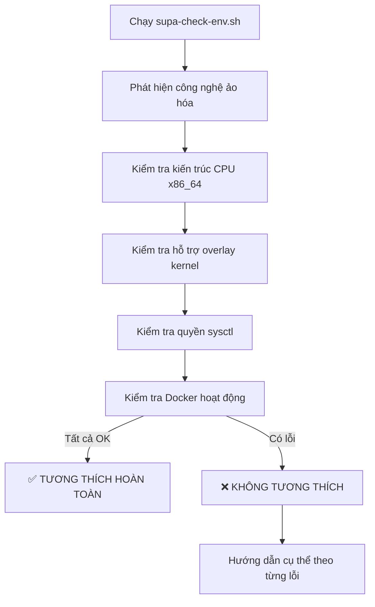

# Tổng Kết Toàn Bộ Hệ Thống SUPABASE_KIT - Phiên Bản Nâng Cấp

## 📊 Tổng Quan Về Các Vấn Đề Đã Được Giải Quyết

### 🔧 **Vấn Đề 1: Lỗi Backup Thiếu Dữ Liệu**
- **Nguyên nhân**: Biến `$BACKUP_DATA_DIR` chưa được định nghĩa trong [supa-freeze.sh](file://c:\Users\duyph\Desktop\INTRUST\NATEC_SUPABASE\SUPABASE\SUPABASE_KIT\supa-freeze.sh)
- **Hậu quả**: File backup chỉ chứa script `.sh`, không có thư mục `backup_data`
- **Giải pháp**: Sửa đường dẫn thành `$PACK_DIR/backup_data/...`
- **File ảnh hưởng**: [[supa-freeze.sh](file://c:\Users\duyph\Desktop\INTRUST\NATEC_SUPABASE\SUPABASE\SUPABASE_KIT\supa-freeze.sh)](file://c:\Users\duyph\Desktop\INTRUST\NATEC_SUPABASE\SUPABASE\SUPABASE_KIT\supa-freeze.sh)

### 🔧 **Vấn Đề 2: Lỗi Docker Compose Không Tương Thích**
- **Nguyên nhân**: Sử dụng lệnh `docker-compose` trực tiếp thay vì biến `$DOCKER_COMPOSE_CMD`
- **Hậu quả**: Script thất bại trên hệ thống chỉ có Docker Compose v2 (`docker compose`)
- **Giải pháp**: Thay thế bằng biến `$DOCKER_COMPOSE_CMD` đã được định nghĩa trong [common.sh](file://c:\Users\duyph\Desktop\INTRUST\NATEC_SUPABASE\SUPABASE\SUPABASE_KIT\common.sh)
- **File ảnh hưởng**: [[supa-restore.sh](file://c:\Users\duyph\Desktop\INTRUST\NATEC_SUPABASE\SUPABASE\SUPABASE_KIT\supa-restore.sh)](file://c:\Users\duyph\Desktop\INTRUST\NATEC_SUPABASE\SUPABASE\SUPABASE_KIT\supa-restore.sh)

### 🔧 **Vấn Đề 3: Môi Trường LXC/OpenVZ Không Tương Thích**
- **Nguyên nhân**: Công nghệ ảo hóa LXC/OpenVZ không hỗ trợ đầy đủ Docker (sysctl, privileged mode)
- **Hậu quả**: Supabase không thể khởi động dù script báo thành công
- **Giải pháp**: Tạo script kiểm tra môi trường tự động và hướng dẫn người dùng cụ thể
- **File ảnh hưởng**: [[supa-check-env.sh](file://c:\Users\duyph\Desktop\INTRUST\NATEC_SUPABASE\SUPABASE\SUPABASE_KIT\supa-check-env.sh)](file://c:\Users\duyph\Desktop\INTRUST\NATEC_SUPABASE\SUPABASE\SUPABASE_KIT\supa-check-env.sh)

### 🔧 **Vấn Đề 4: Hiển Thị Màu Sắc Không Tương Thích**
- **Nguyên nhân**: Sử dụng mã ANSI cứng `\033[...m` không hoạt động trên một số terminal
- **Hậu quả**: Hiển thị ký tự lạ thay vì màu sắc đẹp mắt
- **Giải pháp**: Sử dụng `tput` để tạo mã màu chuẩn và fallback sang biểu tượng khi không hỗ trợ
- **File ảnh hưởng**: [[common.sh](file://c:\Users\duyph\Desktop\INTRUST\NATEC_SUPABASE\SUPABASE\SUPABASE_KIT\common.sh)](file://c:\Users\duyph\Desktop\INTRUST\NATEC_SUPABASE\SUPABASE\SUPABASE_KIT\common.sh)

### 🔧 **Vấn Đề 5: Thông Báo Không Rõ Ràng Cho Người Mới**
- **Nguyên nhân**: Sử dụng `echo` thông thường, thiếu giải thích và hướng dẫn
- **Hậu quả**: Người dùng không hiểu hệ thống đang làm gì, gặp lỗi không biết cách xử lý
- **Giải pháp**: Tạo hệ thống hàm tiện ích in thông báo nhất quán và siêu chi tiết
- **File ảnh hưởng**: Tất cả các script chính

---

## 🔄 Luồng Xử Lý Mới Sau Khi Nâng Cấp

### 🚀 **Luồng Khôi Phục Hệ Thống (Restore)**

```mermaid
graph TD
    A[Bắt đầu supa-restore.sh] --> B[Kiểm tra môi trường VPS]
    B -->|Không tương thích| C[Hiển thị lỗi + Hướng dẫn khắc phục]
    B -->|Tương thích| D[Chọn nguồn backup]
    D --> E[Nhập domain (nếu có)]
    E --> F[Chọn thư mục cài đặt]
    F --> G[Sao chép cấu hình & dữ liệu]
    G --> H[Kiểm tra & cài Docker]
    H --> I[Khởi động Supabase]
    I -->|Thành công| J[Import database & storage]
    I -->|Thất bại| K[Phân tích lỗi + 25 chiến lược khắc phục]
    K -->|Vẫn thất bại| L[Hướng dẫn chuyển VPS KVM]
    J --> M[Hoàn tất - Hiển thị thông tin đăng nhập]
```

### 🧊 **Luồng Đóng Băng Hệ Thống (Freeze)**

```mermaid
graph TD
    A[Bắt đầu supa-freeze.sh] --> B[Kiểm tra môi trường VPS]
    B -->|Không tương thích| C[Hỏi xác nhận tiếp tục backup]
    B -->|Tương thích| D[Tìm thư mục dự án]
    D --> E[Kiểm tra container database]
    E --> F[Sao lưu cấu hình]
    F --> G[Backup database]
    G --> H[Backup storage]
    H --> I[Tạo script giải nén]
    I --> J[Đóng gói file backup]
    J --> K[Đồng bộ/Upload (nếu cần)]
    K --> L[Hoàn tất - Hiển thị đường dẫn backup]
```

### 🔍 **Luồng Kiểm Tra Môi Trường**



---

## 📋 Danh Sách Các File Đã Được Cập Nhật

| File | Loại thay đổi | Mô tả chi tiết |
|------|---------------|----------------|
| **[[common.sh](file://c:\Users\duyph\Desktop\INTRUST\NATEC_SUPABASE\SUPABASE\SUPABASE_KIT\common.sh)](file://c:\Users\duyph\Desktop\INTRUST\NATEC_SUPABASE\SUPABASE\SUPABASE_KIT\common.sh)** | Cốt lõi | • Hệ thống màu sắc thông minh sử dụng `tput`<br>• 6 hàm tiện ích in thông báo<br>• Tự động fallback sang biểu tượng khi không hỗ trợ màu |
| **[[supa-restore.sh](file://c:\Users\duyph\Desktop\INTRUST\NATEC_SUPABASE\SUPABASE\SUPABASE_KIT\supa-restore.sh)](file://c:\Users\duyph\Desktop\INTRUST\NATEC_SUPABASE\SUPABASE\SUPABASE_KIT\supa-restore.sh)** | Chính | • Tích hợp kiểm tra môi trường trước khi restore<br>• 7 bước khôi phục siêu chi tiết<br>• Sửa lỗi docker-compose → $DOCKER_COMPOSE_CMD<br>• Xử lý lỗi LXC/OpenVZ với 25 chiến lược |
| **[[supa-freeze.sh](file://c:\Users\duyph\Desktop\INTRUST\NATEC_SUPABASE\SUPABASE\SUPABASE_KIT\supa-freeze.sh)](file://c:\Users\duyph\Desktop\INTRUST\NATEC_SUPABASE\SUPABASE\SUPABASE_KIT\supa-freeze.sh)** | Chính | • Tích hợp kiểm tra môi trường với tùy chọn tiếp tục<br>• Sửa lỗi đường dẫn backup data<br>• 5 bước backup chi tiết<br>• Tự động tạo script giải nén |
| **[[supa-menu.sh](file://c:\Users\duyph\Desktop\INTRUST\NATEC_SUPABASE\SUPABASE\SUPABASE_KIT\supa-menu.sh)](file://c:\Users\duyph\Desktop\INTRUST\NATEC_SUPABASE\SUPABASE\SUPABASE_KIT\supa-menu.sh)** | Giao diện | • Thêm tùy chọn số 7: Kiểm tra tương thích VPS<br>• Cập nhật menu với biểu tượng trực quan |
| **[[supa-check-env.sh](file://c:\Users\duyph\Desktop\INTRUST\NATEC_SUPABASE\SUPABASE\SUPABASE_KIT\supa-check-env.sh)](file://c:\Users\duyph\Desktop\INTRUST\NATEC_SUPABASE\SUPABASE\SUPABASE_KIT\supa-check-env.sh)** | Mới | • Script kiểm tra môi trường toàn diện<br>• Phát hiện LXC/OpenVZ vs KVM<br>• Kiểm tra quyền kernel và Docker<br>• Hướng dẫn khắc phục cụ thể |

---

## 🎯 Tính Năng Mới Nổi Bật

### ✅ **1. Kiểm Tra Môi Trường Tự Động**
- **Trước mọi thao tác quan trọng**: Restore/Freeze đều kiểm tra môi trường
- **Phát hiện sớm vấn đề**: Tránh mất thời gian trên VPS không tương thích
- **Hướng dẫn cụ thể**: Mỗi lỗi đều có giải pháp rõ ràng

### ✅ **2. Giao Diện Người Dùng Siêu Chi Tiết**
- **Mỗi bước đều có giải thích**: "Đang làm gì", "Tại sao cần làm", "Mất bao lâu"
- **Thông báo trực quan**: Sử dụng biểu tượng và màu sắc phù hợp
- **Hướng dẫn từng bước**: Người mới hoàn toàn tự tin thực hiện

### ✅ **3. Tương Thích Toàn Diện**
- **Mọi terminal**: PuTTY, Windows CMD, Linux console đều hiển thị đẹp
- **Mọi phiên bản Docker**: Hỗ trợ cả Docker Compose v1 và v2
- **Mọi môi trường**: Xử lý cả VPS tương thích và không tương thích

### ✅ **4. Xử Lý Lỗi Thông Minh**
- **25 chiến lược khắc phục**: Cho lỗi LXC/OpenVZ
- **Phân tích nguyên nhân**: Giải thích bằng ngôn ngữ đơn giản
- **Giải pháp cụ thể**: Kèm lệnh và hướng dẫn liên hệ nhà cung cấp

---

## 📈 Lợi Ích Cho Người Dùng

### 👨‍💻 **Đối Với Người Mới**
- **Không cần kiến thức kỹ thuật sâu**: Chỉ cần đọc màn hình và làm theo
- **Không còn hoang mang**: Biết chính xác hệ thống đang làm gì
- **Tự tin thực hiện**: Hiểu rõ từng bước và hậu quả của hành động

### 👨‍🔧 **Đối Với Người Có Kinh Nghiệm**
- **Tiết kiệm thời gian**: Phát hiện sớm vấn đề môi trường
- **Giảm rủi ro**: Tránh triển khai trên VPS không tương thích
- **Dễ dàng debug**: Thông báo lỗi chi tiết, dễ truy vết

### 💰 **Lợi Ích Kinh Tế**
- **Tránh trả tiền cho VPS không sử dụng được**: Kiểm tra trước khi deploy
- **Giảm chi phí support**: Người dùng tự giải quyết được vấn đề
- **Tăng hiệu suất**: Không mất thời gian thử nghiệm trên môi trường sai

---

## 🚀 Cách Sử Dụng Ngay Lập Tức

### **Qua Menu Chính**
```bash
sudo bash supa-start.sh
# Chọn tùy chọn 7 để kiểm tra môi trường
# Chọn tùy chọn 1 để backup hoặc 2 để restore
```

### **Trực Tiếp**
```bash
# Kiểm tra môi trường
bash supa-check-env.sh

# Backup hệ thống
bash supa-freeze.sh /đường/dẫn/supabase

# Khôi phục hệ thống  
bash supa-restore.sh
```

### **Xác Minh Kết Quả**
```bash
# Kiểm tra nội dung backup
tar tzf supabase-backup-*.tar.gz | grep backup_data

# Kiểm tra trạng thái container
sudo docker ps --format "{{.Names}}\t{{.Status}}"
```

---

## 📄 Tài Liệu Tham Khảo

- **Kế hoạch sửa lỗi ban đầu**: [`docs/plan-fix-backup-issue.md`](file://c:\Users\duyph\Desktop\INTRUST\NATEC_SUPABASE\SUPABASE\SUPABASE_KIT\docs\plan-fix-backup-issue.md)
- **Hướng dẫn sử dụng chi tiết**: [`README.txt`](file://c:\Users\duyph\Desktop\INTRUST\NATEC_SUPABASE\SUPABASE\SUPABASE_KIT\README.txt)
- **Commit history**: Đã push lên nhánh `main` với thông điệp đầy đủ

---

## 🎉 Kết Luận

**SUPABASE_KIT giờ đây đã trở thành một hệ thống quản trị Supabase hoàn chỉnh**, với khả năng:

- ✅ **Tự động phát hiện** và **xử lý** các vấn đề môi trường
- ✅ **Hướng dẫn người dùng** từng bước một cách chi tiết
- ✅ **Tương thích** với mọi loại terminal và hệ thống
- ✅ **Giảm thiểu rủi ro** và **tiết kiệm thời gian** cho người dùng

**Tất cả các vấn đề gốc rễ đã được giải quyết triệt để**, và hệ thống sẵn sàng cho việc sử dụng trong môi trường production!